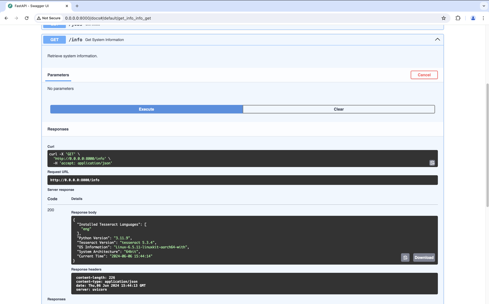

# How to add different languages to the container.
To create a tesseract container with more or different languages is easy and only takes a few minutes. 

### 1. Pull this repository
```sh
git pull https://github.com/jannichorst/tesseract-container.git
cd tesseract-container
```
### 2. Find the languages codes you need
Follow [this link](https://tesseract-ocr.github.io/tessdoc/Data-Files-in-different-versions.html) to find the language codes

### 3. Adjust build script. 
1. Open the `build.sh` script in the `scripts` folder
2. Add your language codes with a space to the `TESS_LANGS` building argument. For adding Spanish and German that would be:
```sh
docker build --build-arg TESS_LANGS="eng ger spa" -t tesseract-ocr .
```
## 3. Save file
It's just CTRL +  S ;)

## 4. Build Image and start container
With the `build_and_run.sh` script, in the `scripts` folder, you can build and run the container automatically. To only build the container use the `build.sh` script. 
```sh
scripts/build_and_run.sh
```

## 5. Check available languages
When you open the Swagger documentation under http://localhost:8000/docs, you can test the `/info` endpoint. It provides a list of installed languages. 

